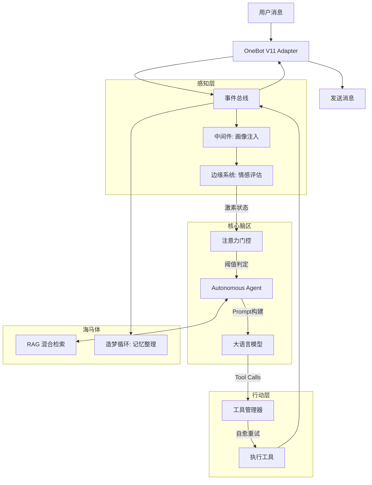

# Aethel-v3 (Project Code: Trinity)

**Aethel-v3** 是一个高度仿生、事件驱动的自主 AI Agent 框架。

不同于传统的“请求-响应”式聊天机器人，Aethel-v3 旨在构建一个拥有**模拟生理系统（边缘系统）**、**长期记忆（海马体）**、**自主决策（前额叶）和自我进化能力**的数字生命。它能通过激素水平感知压力与兴奋，根据“心情”决定是否回复消息，并随着与用户的交互逐渐模仿群组的语言风格。

## 🧠 核心特性

### 1. 仿生边缘系统

* **神经递质模拟**：内置多巴胺 (Dopamine)、皮质醇 (Cortisol)、催产素 (Oxytocin) 等激素模型。激素随外界刺激（如夸奖、辱骂）波动，并按半衰期自然代谢。
* **情绪驱动行为**：
* **高多巴胺**：表现出兴奋、话痨、更有创造力。
* **高皮质醇**：表现出焦虑、防御性强，甚至拒绝执行任务。


* **稳态与内驱力**：当“社交饱腹感”过低时，Agent 会主动发起对话；当“认知能量”耗尽时，会进入休息状态。

### 2. 深度认知架构

* **动态注意力门控**：不是所有消息都会触发回复。系统根据当前生理状态和对消息的“兴趣度”（语义相似度）动态计算阈值。太无聊或压力太大时，它会选择“已读不回”。
* **无限上下文**：自动检测对话长度，利用 LLM 对旧记忆进行语义压缩和摘要，在保持关键信息的同时突破 Token 限制。
* **双层记忆系统**：
* **快车道**：短期工作记忆 (Scratchpad)。
* **慢车道**：后台异步处理，将对话提炼为结构化的**核心记忆 (Core Memory)** 和 **情景记忆 (Episodic Memory)** 存入向量数据库。


### 3. 强大的工具与自愈

* **自愈机制**：如果工具调用失败（如参数错误），Agent 会自动分析错误堆栈，修正参数并重试，无需人工干预。
* **内置工具箱**：
* **Code Interpreter**：持久化的 Python 代码沙箱，支持复杂计算和数据处理。
* **Web Search**：联网搜索获取最新信息。
* **FileSystem**：本地文件读写管理。


### 4. 社会化进化

* **拟态学习**：自动分析群聊记录，学习高频梗、表情包和句式，让 Agent 的说话风格逐渐“本地化”。
* **用户画像**：实时维护用户的信任度、好感度和印象标签，并据此动态调整交互策略。

### 5. 可视化监控

* 提供基于 PyQt6 的**实时神经监控矩阵**，可视化查看 AI 的激素水平、思维流和任务执行状态。

---

## 🏗️ 系统架构 (Architecture)

Aethel-v3 采用基于 `asyncio` 的全异步事件总线设计：



---

## 📂 项目结构

```text
Aethel-v3/
├── main.py                 # 系统启动入口
├── db_mg.py                # 数据库管理 GUI
├── core/
│   ├── kernel/             # 核心逻辑 (Agent, Attention, Prompt)
│   ├── limbic/             # 边缘系统 (激素, 情绪评估, 稳态)
│   ├── memory/             # 记忆系统 (海马体, 向量库, 摘要)
│   ├── tool_manager/       # 工具管理与自愈机制
│   ├── social/             # 社交关系与用户画像
│   ├── evolution/          # 进化模块 (模仿学习)
│   ├── io/                 # 输入输出 (事件总线, 适配器)
│   ├── gui/                # 监控仪表盘 (PyQt6)
│   └── infrastructure/     # 基础设施 (DB, Config, Logger)
├── tools/                  # 具体工具实现 (Network, Code, etc.)
└── data/                   # 配置文件与 Prompt 模板

```

---

## 🚀 快速开始 (Quick Start)

### 前置要求

* Python 3.10+
* OneBot v11 实现 (如 NapCat, Lagrange, Go-CQHttp)
* OpenAI 格式兼容的 API Key (OpenAI 等，需要支持tool-call、json-schema)

### 1. 安装依赖

```bash
git clone https://github.com/furryaxw/Aethel-v3.git
cd Aethel-v3
pip install -r requirements.txt

```

### 2. 配置文件

复制默认配置模板：

```bash
cp data/default-config.yaml data/config.yaml

```

编辑 `data/config.yaml`，填入您的 API Key 和配置信息：

```yaml
llm:
  base_url: "https://api.openai.com/v1"
  api_key: "sk-xxxxxx"
  model: "gpt-4o"

onebot:
  ws_url: "ws://127.0.0.1:3001"  # 您的 OneBot WebSocket 地址

```

### 3. 启动系统

启动主程序（包含 Agent 核心与监控 GUI）：

```bash
python main.py

```

* **Console**: 终端会显示详细的日志流。
* **GUI**: 会弹出一个仪表盘窗口，显示当前的激素进度条和思维过程。

### 4. 数据库管理 (可选)

如果需要查看或手动修改记忆库/用户画像，可运行数据库管理器：

```bash
python db_mg.py

```

---

## 🛠️ 工具开发

在 `tools/` 目录下创建新的 Python 文件，使用 `@register` 装饰器即可添加新能力：

```python
from core.tool_manager.registry import register

@register()
async def my_custom_tool(query: str):
    """
    这是一个自定义工具的示例

    Args:
        query: 输入参数
    """
    return f"工具执行成功: {query}"

```

---

## ⚠️ 免责声明

* 本项目是一个实验性的 AI 认知架构研究项目。
* **代码执行风险**：项目中包含 Python 代码解释器 (`Code Interpreter`)，虽然有基础的安全检查，但在生产环境中运行任意生成的代码仍存在风险。建议在 Docker 容器或沙箱环境中运行。
* **不可预测性**：由于引入了激素和自主决策机制，Agent 的行为可能具有不可预测性（例如突然拒绝回答问题），这是设计特性而非 Bug。

## 📄 License

本项目采用 [GPL-3.0 License](LICENSE) 开源许可。